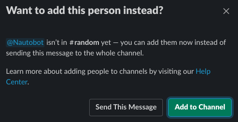

# Slack Setup

| Configuration Setting        | Mandatory? | Default |
| ---------------------------- | ---------- | ------- |
| `enable_slack`               | **Yes**    | False   |
| `slack_api_token`            | **Yes**    | --      |
| `slack_signing_secret`       | **Yes**    | --      |
| `slack_slash_command_prefix` | No         | `"/"`   |

1. Log in to [https://api.slack.com/apps](https://api.slack.com/apps) and select "Create New App".
   - Enter "Nautobot Chatops" as the "App Name"
   - Select your preferred Slack workspace as the "Development Slack Workspace"
   - Click "Create App"
2. On the "Basic Information" page for your app, under "Add features and functionality", select "Interactive Components"
   - Set the toggle to "On"
   - Enter the HTTPS URL of the Slack `interaction` endpoint for your Nautobot installation - it should be something
     like `https://<server>/api/plugins/chatops/slack/interaction/` (note the trailing slash)
   - Select "Save Changes"
3. On the "Basic Information" page for your app, under "Add features and functionality", select "Slash Commands"
   - Decide now whether your setup requires a command prefix to disambiguate this bot's commands from those understood
     by other bots (such as if you have multiple older Nautobot Chatops versions also enabled), such as `/nautobot-` or `/na-`
   - This part is a bit tedious, but for each supported command (e.g. `/nautobot`, `/grafana`) you will need to:
     - Select "Create New Command"
     - Enter the command text, the request URL (`https://<server>/api/plugins/chatops/slack/slash_command/` in all cases),
       and the description and usage hints
     - Select "Save"
   - It's up to you whether to configure only the top-level commands (`/nautobot`, etc.) or whether
     you wish to configure all of the sub-commands as slash-commands as well (`/nautobot-get-devices`, `/nautobot-get-facts`,
     etc.). The sub-commands can always be entered as parameters to the top-level commands in any case
     (`/nautobot get-devices`) whether or not you also define them as first-class slash-commands in their own right.
   - TODO: we need a helper script that could be easily run to generate a full listing of subcommands so that a new
     deployer can know what all they need to set up!
4. On the "Basic Information" page for your app, under "App Credentials", find the "Signing Secret" and click "Show".
   You will need to configure this value for the plugin as the `slack_signing_secret` value, such as through the
   `.creds.env` file. If this value is not correctly configured, the bot will be unable to validate that inbound
   notifications it receives have been properly signed by the Slack server.
5. In the sidebar to the left, select "OAuth & Permissions".
   - Under "Scopes", select "Add an OAuth Scope", and add the following scopes:
      - `chat:write`
      - `commands`
      - `channels:read`
      - `files:write`
      - `incoming-webhook`
      - `users:read`
      - `app_mentions:read`
      - `groups:read`
      - `im:read`
      - `mpim:read`
   - At the top of this page, select "Install App to Workspace" and confirm it.
   - There should now be a "Bot User OAuth Access Token" displayed, typically a string starting with `xoxb-`.
     You will need to configure this value for the plugin as the `slack_api_token` value, such as through the
     `.creds.env` file. If this value is not properly configured, the bot will be unable to send content to the user.
6. Returning to the "Basic Information" page for your app, under "Display Information", you can specify the name,
   description, icon, and accent/background color for the app. You can use the `nautobot_logo.png` from this
   directory if desired.
7. Proceed to the general process to "Grant access to the chatbot" below.

> **Note** You will need to invite the chatbot to each channel that it will belong to with `@Nautobot`.

